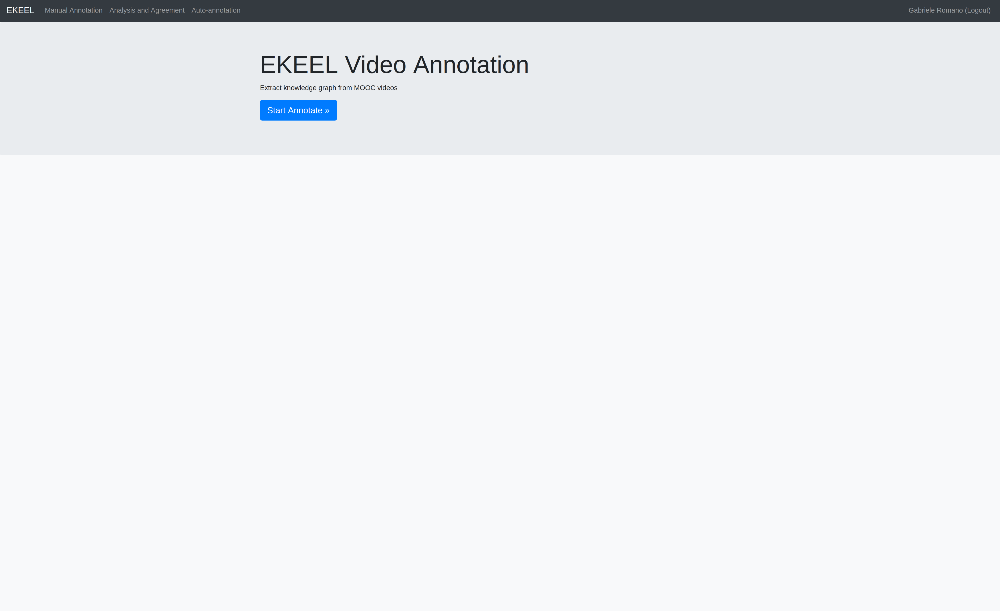
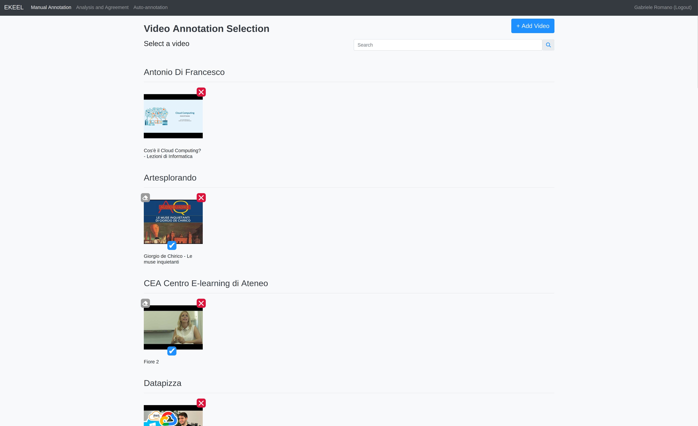

# Documentation for `EKEEL` apps
For deep overview of the system look [here](reports/System%20Overview.pdf) or click ->
<button onclick="const spec = document.getElementById('system-overview'); if(spec.style.display==='block'){ spec.style.display='none'; this.innerHTML=this.innerHTML.replace('Hide','Show'); } else { spec.style.display='block'; this.innerHTML=this.innerHTML.replace('Show','Hide'); }" style="cursor: pointer">
    `Show System Overview`
</button>

{ type=application/pdf id="system-overview" style="min-height:70vh;width:100%; display:none" }

For annotation protocol specifications look [here](reports/PREAP%20Annotation%20Protocol%20specifications.pdf) or click ->
<button onclick="const spec = document.getElementById('protocol-specifications'); if(spec.style.display==='block'){ spec.style.display='none'; this.innerHTML=this.innerHTML.replace('Hide','Show'); } else { spec.style.display='block'; this.innerHTML=this.innerHTML.replace('Show','Hide'); }" style="cursor: pointer">
    `Show Annotation Protocol`
</button>

{ type=application/pdf id="protocol-specifications" style="min-height:70vh;width:100%; display:none" }

## `Annotator Tool`
The Annotator Tool is a web application designed to facilitate the annotation of videos. It involves several key actors: A Vanilla Javascript frontend, a Python Flask backend, a MongoDB database, and a python Whisper Transcriber service running on the same machine in the backend. The tool allows users to interact with the frontend to perform various tasks such as opening the website, registering, annotating videos, comparing annotations and make automatic annotations. The transcriber service periodically processes untranscribed videos and updates the database. 

### `Sequence Diagrams`

Follows sequence diagrams of typical function calls: 
<button onclick="
    const graphs = document.getElementsByClassName('mermaid-container');
    if (graphs[0].style.display === 'block') {
        for(graph of graphs)
            graph.style.display = 'none';
        this.innerHTML = this.innerHTML.replace('Hide', 'Show');
    } else {
        for(graph of graphs)
            graph.style.display = 'block';
        this.innerHTML = this.innerHTML.replace('Show', 'Hide');
    }
" style="cursor: pointer">
    `Hide Sequence Diagrams`
</button>

#### `Homepage Access`
Interaction between a user, the frontend, and the backend when a user opens a website. The user sends a request to the frontend to open the website. The frontend then sends a GET request to the backend to retrieve the main page data. The backend processes this request by calling a function in the Flask application and then sends the response back to the frontend. The frontend processes the response and renders the main page for the user.

 

#### `Registration Process`
The main actors are a user, the frontend (JS-Frontend), the backend (Flask-Backend), and the database (MongoDB). The process starts with the user clicking the "Sign up" button, prompting the frontend to send a GET request to the backend to load the registration page. The backend processes this request and the frontend renders the registration form. The user fills out the form and submits it, causing the frontend to send a POST request to the backend. The backend inserts the user's data into an unverified users collection in MongoDB and, upon receiving a response from MongoDB, sends a response back to the frontend, which renders a confirmation code page. The user then submits the confirmation code, and the frontend sends another POST request to the backend. If the code is correct, the backend deletes the user from the unverified users collection and inserts them into the verified users collection in MongoDB, then sends a response back to the frontend, which renders a success message. If the code is incorrect, the backend updates the unverified user's data in MongoDB and sends a response back to the frontend, which displays an error message. This sequence outlines the interactions between the user, frontend, backend, and database during the registration process.

 

#### `Video Insertion`
The main actors are: A user, the frontend (JS-Frontend), the backend (Flask-Backend), the database (MongoDB), and the transcriber service. The process begins with the user clicking the "Manual Annotator" button, which triggers a series of interactions. The frontend sends a GET request to the backend to load the video selection page, while the transcriber service periodically wakes up every 60 seconds to query the database for untranscribed videos. The backend processes the request and queries the database to retrieve video data, then sends the response back to the frontend, which renders the video selection page. The user then inserts a URL, prompting the frontend to send a POST request to the backend to add the video. The backend downloads the video, performs automatic transcription, and extracts terms and thumbnails, then inserts the video data into the database. The transcriber service transcribes the video and updates the database with the transcription data. Concurrently, the backend creates an interactable transcript in HTML, queries the database for additional data such as concept maps, definitions, annotation status, and vocabulary, and adds concepts and relations to the payload. Finally, the backend sends the response back to the frontend, which renders the MOOC annotator page. This sequence outlines the interactions between the user, frontend, backend, database, and transcriber service during the video annotation process.

 

#### `Performing Annotation`
The process begins with the user logging in and opening the Manual Annotator, which prompts the backend to send the video selection page to the frontend for rendering. The user then clicks on a video to annotate it, causing the frontend to send a POST request to the backend. The backend processes this request by initializing the VideoAnalyzer and querying MongoDB for video data. After receiving the data, the backend creates an interactable transcript in HTML and retrieves additional information such as concept maps, definitions, annotation status, and vocabulary from MongoDB. This data is then added to the payload and sent back to the frontend, which renders the MOOC annotator page. During the annotation process, whenever the user adds a description to a concept and clicks "Add Description," the frontend updates the local description and network scripts, then sends a POST request to the backend to upload the annotated graph. The backend processes this request by inserting the graph into MongoDB and responds to the frontend with the success or failure status, which the frontend handles accordingly. This sequence outlines the interactions between the user, frontend, backend, and database during the video annotation process.

 

### Homepage View
The homepage view of the Annotator application provides an overview of the available features and functionalities. It serves as the entry point for users to navigate to different sections of the application.

### Video Selection View
The video selection view allows users to browse and select videos for annotation. This view displays a list of available videos, along with relevant metadata such as titles, descriptions, and thumbnails. Users can choose a video to start the annotation process.

### Annotator View
The annotator view is where users perform the actual annotation of the selected video. This view provides tools and controls for annotating the video, such as adding concepts and synonyms, adding and editing descriptions, bounding box of concepts, relations, downloading the Graph in JSON format and the transcript enriched with the annotations. Users can play, pause, and navigate through the video while making annotations.

### `Slides Extraction`

The full document can be found [here](reports/SWLD2023%20-%20Video%20Slide%20Segmentation.pdf) or click ->
<button onclick="const spec = document.getElementById('video-segmentation'); if(spec.style.display==='block'){ spec.style.display='none'; this.innerHTML=this.innerHTML.replace('Hide','Show'); } else { spec.style.display='block'; this.innerHTML=this.innerHTML.replace('Show','Hide'); }" style="cursor: pointer">
    `Show Slide Segmentation Protocol`
</button>

{ type=application/pdf id="video-segmentation" style="min-height:70vh;width:100%; display:none" }

#### `Short Summary`
The system analyzes videos to identify and segment slide-based content using machine learning and OpenCV. Initially, the video undergoes a coarse analysis to determine if it contains a significant percentage of slides. A pre-trained model classifies images as "slidish," and this classification is validated using OpenCV.

If the video meets the "slide threshold," further analysis is conducted. The segmentation process involves extracting keyframes based on color histograms and analyzing text to determine slide titles and content. Titles are identified through statistical analysis of text height and position, and concepts are extracted using phrasemachine. Each segment is compacted by merging similar or overlapping text and validated through a double-checking mechanism.

The platform uses Python and relies on several core classes. The ImageClassifier handles face and text detection, as well as color conversions. The LocalVideo class manages video loading, frame extraction, and resizing using OpenCV. The VideoSpeedManager adds logic for efficient frame extraction. The TimedAndFramedText dataclass stores text, bounding box positions, and video frame ranges for slide segments. The VideoAnalyzer processes video transcription, keyframe segmentation, and slide classification, identifying slides and validating segments.

The system includes a process scheduler that automatically segments videos, saving results to a database. This enables the reconstruction of slides and timeframes for further analysis or playback. Concepts and definitions are heuristically extracted based on the appearance of terms in transcripts and slide durations. This comprehensive process ensures accurate segmentation and analysis of educational videos containing slides.

!!! info
    In the current implementation, slides extraction has been disabled to avoid overloading the server and should be reimplemented using novel NLP models like [LLaVA](https://llava-vl.github.io/)

## `Augmentator Tool`

The Augmentator Tool is a specialized web application designed to enhance educational videos through automatic concept detection and knowledge graph generation. It analyzes video content, extracts key concepts and their relationships, and presents them in an interactive visual format. The tool allows educators and learners to navigate complex educational content through temporal concept maps, making it easier to understand concept dependencies and progression throughout the video.
The system processes both video transcripts and visual elements to identify important educational concepts, their temporal occurrences, and their interconnections. 
Users can interact with the generated knowledge graphs, explore concept definitions at specific timestamps, and visualize how different concepts relate to each other within the educational context. The tool supports multiple languages and integrates with various video platforms, making it versatile for different educational settings and content types. Its primary goal is to transform linear video content into an interactive learning experience that highlights conceptual understanding and knowledge structure.

!!! note
    Currently not working for deprecation issues

